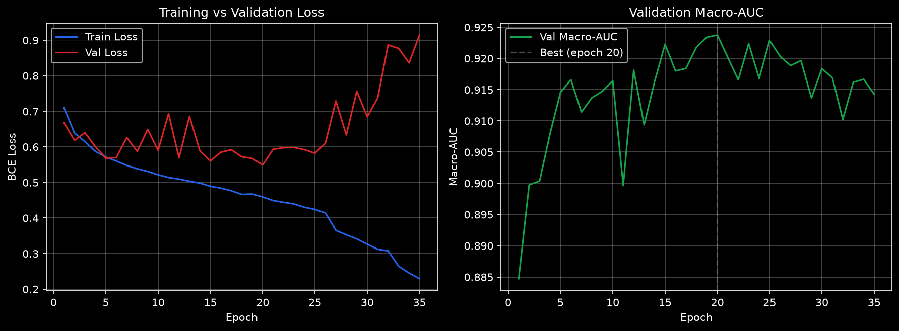

# ECG Multi-Label Diagnostic Classification — PTB-XL (1D-CNN)

## Overview
Multi-label classification of 12-lead ECG signals into 5 diagnostic superclasses 
(NORM, MI, STTC, CD, HYP) using a custom 1D-CNN in PyTorch, trained on the PTB-XL dataset.

## Dataset
- PTB-XL: 21,837 12-lead ECG recordings, 100Hz, 10s each
- Official stratified folds used (train: folds 1-8, val: fold 9, test: fold 10)
- Multi-label targets derived from SCP diagnostic codes, aggregated to 5 superclasses

## Architecture
- Custom 1D-CNN, 7 conv blocks (tapered kernel sizes 15→3), BatchNorm + ReLU + MaxPool
- Global Average Pooling + 2-layer FC head with dropout
- 1,007,269 parameters
- [architecture diagram or code snippet]

## Data

This project uses the [PTB-XL dataset](https://physionet.org/content/ptb-xl/1.0.3/) 
(Wagner et al., 2020), publicly available via PhysioNet. The dataset (~1.7GB) is not 
included in this repo due to size.

To reproduce:
1. Download PTB-XL from PhysioNet: `wget -r -N -c -np https://physionet.org/files/ptb-xl/1.0.3/`
2. Update `DATASET_ROOT` path in the notebook to point to your local download location
3. Run `data_handling.ipynb` (or your renamed notebook) top to bottom

## Training
- Loss: BCEWithLogitsLoss with pos_weight for class imbalance
- Optimizer: Adam (lr=1e-3, weight_decay=1e-4)
- LR scheduler: ReduceLROnPlateau (monitor val macro-AUC)
- Early stopping (patience=15), stopped at epoch 35/100
- 

## Results

Test set (fold 10):

| Metric | Score |
|---|---|
| Macro-AUC | 0.9209 |

| Class | AUC |
|---|---|
| NORM | 0.9445 |
| STTC | 0.9290 |
| MI | 0.9173 |
| CD | 0.9114 |
| HYP | 0.9021 |

Despite a ~7x class imbalance between the rarest (HYP) and most common (NORM) 
classes, per-class AUC spread is only ~0.04, indicating the pos_weight-based 
loss weighting effectively mitigated imbalance.

## Benchmark Comparison
Results are competitive with published PTB-XL baselines (Strodthoff et al., 2020),
despite using a substantially smaller model (~1M params vs. ResNet/Inception baselines).

## Repo Structure
├── data_handling.ipynb    # preprocessing, label aggregation, dataset/dataloader
├── model.py                # ECGClassifier architecture
├── train.py                 # training loop
├── best_model.pt            # trained weights
├── training_curves.png
└── README.md

## References
- Wagner, P. et al. PTB-XL, a large publicly available electrocardiography dataset. 
  Scientific Data (2020).
- Strodthoff, N. et al. Deep Learning for ECG Analysis: Benchmarks and Insights 
  from PTB-XL. IEEE JBHI (2021).